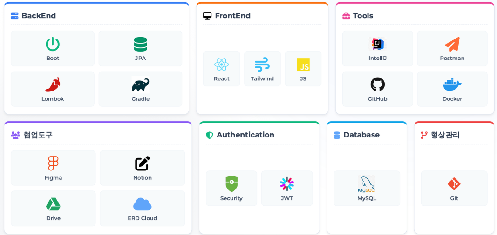

# PickCar


## 📋 프로젝트 소개

 - 공유차량 통합운영관리 및 예약 플랫폼

---

## 👥 팀원

| 이름 | 역할 | GitHub | 담당 기능 |
|------|------|--------|-----------|
| 강화민 | 팀장 | [@hamin-kang](https://github.com/hamin-kang) | 차량 예약 · 결제 · 일정 관리 · 이슈 관리 |
| 권재현 | 부팀장 | [@Galmaeki](https://github.com/Galmaeki) | 프로젝트 리드 · 코드 리뷰 · 마이페이지 · 지점 관리 |
| 김혜진 | 팀원 | [@kimhyejin1030](https://github.com/kimhyejin1030) | 통계 · 쿠폰 관리 · 차량 정보 관리 |
| 이대승 | 팀원 | [@bigwin0207](https://github.com/bigwin0207) | 정비 관리 · 회원 관리 · 알림 |
| 조재표 | 팀원 | [@berichmore](https://github.com/berichmore) | Security · 로그인 · 직원 관리 |


## ✨ 주요 기능

### 👥 회원 관리
- 고객 회원가입 및 로그인 (JWT)
- 회원 정보 관리
- 블랙리스트 관리

### 🚙 차량 관리
- 차량 등록 및 정보 관리
- 차량 상태 관리 (대기/운행중/정비중)
- 차량 검색 및 필터링
- 지점별 차량 배치 관리

### 📅 렌탈 관리
- 차량 예약 및 대여
- 실시간 차량 운행 상태 추적
- 대여 이력 조회
- 렌탈 요금 자동 계산

### 🔧 정비 관리
- 정비 예약 및 스케줄 관리
- 소모품 교체 이력 추적
- 정비 알림 시스템
- 정비 비용 관리

### 🚨 사고 관리
- 사고 신고 및 접수
- 사고 처리 상태 관리 (신고/수리중/수리완료/소송)
- 수리 비용 및 고객 책임 비용 산정

### 🎫 쿠폰 관리
- 쿠폰 생성 및 발급
- 고객별 쿠폰 보유 현황
- 쿠폰 사용 이력 관리

### 💳 결제 시스템
- 포트원(PortOne) 결제 연동
- 결제 내역 관리

### 📢 공지사항
- 공지사항 작성 및 관리
- 공지사항 조회

### 📊 통계
- 렌탈 통계 조회
- 매출 분석
- 차량 이용률 분석

### 🏢 지점 관리
- 전국 지점 정보 관리
- 지점별 직원 및 차량 현황
- 지점별 통계

---

## 🛠 기술 스택



### Backend
- **Framework**: Spring Boot 4.0.1
- **Language**: Java 21
- **Database**: MySQL 8.0
- **ORM**: Spring Data JPA

### Security
- **Authentication**: Spring Security
- **Authorization**: JWT

### Frontend
- **Template Engine**: React

### Payment
- **PG**: 포트원 (PortOne)

---

## 📁 프로젝트 구조

```
PickCar/
├── src/
│   ├── main/
│   │   ├── java/com/erp/
│   │   │   ├── ErpApplication.java          # 메인 애플리케이션
│   │   │   ├── common/                      # 공통 유틸리티
│   │   │   ├── domain/                      # 도메인 계층
│   │   │   │   ├── accident/                # 사고 관리
│   │   │   │   ├── alert/                   # 알림
│   │   │   │   ├── branch/                  # 지점 관리
│   │   │   │   ├── car/                     # 차량 관리
│   │   │   │   ├── client/                  # 고객 관리
│   │   │   │   ├── coupon/                  # 쿠폰 관리
│   │   │   │   ├── employee/                # 직원 관리
│   │   │   │   ├── maintenance/             # 정비 관리
│   │   │   │   ├── notice/                  # 공지사항
│   │   │   │   ├── payment/                 # 결제
│   │   │   │   ├── rent/                    # 렌탈 관리
│   │   │   │   └── statistics/              # 통계
│   │   │   └── global/                      # 글로벌 설정 (Security, JWT 등)
│   │   └── resources/
│   │       ├── application.yml              # 애플리케이션 설정
│   │       ├── data.sql                     # 초기 데이터
│   │       └── static/                      # 정적 리소스
│   └── test/                                # 테스트 코드
├── build.gradle                             # Gradle 빌드 설정
└── README.md
```

---

### ERD


---

## 📝 문서화

📌 **전체 API 명세서**: [Notion API 문서](https://www.notion.so/API-2d983ae6eff080cbbc0df3679f3b9129)

📌 **팀 노션**: [Notion 팀 노션](https://www.notion.so/3-2cb83ae6eff08162b9abc6b4b800eab4)