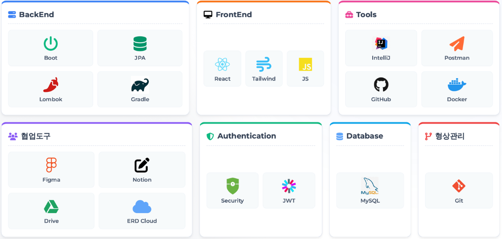

# 🚗 PickCar: 공유차량 통합 운영 관리 및 예약 플랫폼


## 📋 프로젝트 개요

**PickCar**는 서울 시내 6개 주요 거점을 중심으로 운영되는 공유 차량 플랫폼이다. 
    일반 사용자를 위한 **B2C 예약 서비스**와 본사 및 지점 운영을 위한 **통합 운영 관리 시스템(Back-office)** 을 이원화하여 제공한다.

* **프로젝트명**: PickCar
* **개발 기간**: 2026.01.07 ~ 2026.01.27
* **주요 목표**: 실시간 차량 예약, 지점별 자산 관리, 정교한 요금 정책 및 사고/정비 이력 관리의 통합화.

---

## 👥 팀원 소개

|     이름      |        포지션         | 담당 역할 (Responsibilities)                                                                                                     |                   GitHub                    |
|:-----------:|:------------------:|:-----------------------------------------------------------------------------------------------------------------------------|:-------------------------------------------:|
| **👑 강화민**  |    **PM / BE**     | **📅 프로젝트 총괄**<br>- 전체 일정 및 이슈 관리<br>**💳 예약 & 결제 시스템**<br>- 공유 차량 예약 프로세스 및 결제 연동<br>**🚗 차량 사고 접수 및 처리 프로세스 구현**           |  [@Github](https://github.com/hamin-kang)   |
| **💻 권재현**  | **FE Leader / BE** | **🎨 프론트엔드 아키텍처**<br>- 공통 컴포넌트 설계 및 구현<br>**👤 마이페이지 & 지점 관리**<br>- 지점별 자산 관리 기능 구현<br>**🛠 백엔드 코드 관리**                      |   [@Github](https://github.com/Galmaeki)    |
| **📈 김혜진**  |       **BE**       | **📊 통계 & 데이터 시각화**<br>- 매출/가동률 대시보드 구현<br>**🎫 쿠폰 시스템**<br>- 쿠폰 발급/관리 및 유효성 검증 로직<br>**🚗 차량 정보 관리**<br>- 차량 등록 및 현황 관리 시스템 | [@Github](https://github.com/kimhyejin1030) |
| **🛠️ 이대승** |       **BE**       | **🔧 차량 정비 관리**<br>- 정비 일정/이력 관리 및 로직 구현<br>**🔔 실시간 알림 서비스**<br>- 정비/예약 관련 알림 구현<br>**👥 회원 관리**<br>- 회원 정보 수정 및 관리 프로세스    |  [@Github](https://github.com/bigwin0207)   |
| **🛡️ 조재표** |       **BE**       | **🔐 인증/인가 (Security)**<br>- JWT 기반 로그인/인증 구현<br>**👮‍♂️ 권한 관리**<br>- 관리자(직원) 등록 및 권한 부여 프로세스<br>- 회원가입 프로세스 구현              |  [@Github](https://github.com/berichmore)   |

---

## 📝 문서

📌 **전체 API 명세서**: [Notion API 문서](https://www.notion.so/API-2d983ae6eff080cbbc0df3679f3b9129)

📌 **팀 노션**: [Notion 팀 노션](https://www.notion.so/3-2cb83ae6eff08162b9abc6b4b800eab4)

---

## 🛠 기술 스택

### Backend

* **Language**: Java 21
* **Framework**: Spring Boot 4.0.1
* **ORM**: Spring Data JPA
* **Security**: Spring Security, JWT (Json Web Token)
* **Database**: MySQL
* **Build Tool**: Gradle

### Frontend

* **Library**: React
* **Style**: Tailwind CSS

---

## ✨ 주요 기능

### 👥 회원 관리
- 고객 회원가입 및 로그인 (JWT)
- 회원 정보 관리
- 블랙리스트 관리

### 🚙 차량 관리
- 차량 등록 및 정보 관리
- 차량 상태 관리 (대기/운행중/정비중)
- 차량 검색 및 필터링
- 지점별 차량 배치 관리

### 📅 차량 대여 관리
- 차량 예약 및 대여
- 실시간 차량 운행 상태 추적
- 대여 이력 조회
- 대여 요금 자동 계산

### 🔧 정비 관리
- 정비 예약 및 스케줄 관리
- 소모품 교체 이력 추적
- 정비 알림 시스템
- 정비 비용 관리

### 🚨 사고 관리
- 사고 신고 및 접수
- 사고 처리 상태 관리 (신고/수리중/수리완료/소송)
- 수리 비용 및 고객 책임 비용 산정

### 🎫 쿠폰 관리
- 쿠폰 생성 및 발급
- 고객별 쿠폰 보유 현황
- 쿠폰 사용 이력 관리

### 💳 결제 시스템
- 포트원(PortOne) 결제 연동
- 결제 내역 관리

### 📢 공지사항
- 공지사항 작성 및 관리
- 공지사항 조회

### 📊 통계
- 렌탈 통계 조회
- 매출 분석
- 차량 이용률 분석

### 🏢 지점 관리
- 전국 지점 정보 관리
- 지점별 직원 및 차량 현황
- 지점별 통계

---

## 📁 프로젝트 구조

```
PickCar/
├── src/
│   ├── main/
│   │   ├── java/com/erp/
│   │   │   ├── ErpApplication.java          # 메인 애플리케이션
│   │   │   ├── common/                      # 공통 유틸리티
│   │   │   ├── domain/                      # 도메인 계층
│   │   │   │   ├── accident/                # 사고 관리
│   │   │   │   ├── alert/                   # 알림
│   │   │   │   ├── branch/                  # 지점 관리
│   │   │   │   ├── car/                     # 차량 관리
│   │   │   │   ├── client/                  # 고객 관리
│   │   │   │   ├── coupon/                  # 쿠폰 관리
│   │   │   │   ├── employee/                # 직원 관리
│   │   │   │   ├── maintenance/             # 정비 관리
│   │   │   │   ├── notice/                  # 공지사항
│   │   │   │   ├── payment/                 # 결제
│   │   │   │   ├── rent/                    # 렌탈 관리
│   │   │   │   └── statistics/              # 통계
│   │   │   └── global/                      # 글로벌 설정 (Security, JWT 등)
│   │   └── resources/
│   │       ├── application.yml              # 애플리케이션 설정
│   │       ├── data.sql                     # 초기 데이터
│   │       └── static/                      # 정적 리소스
│   └── test/                                # 테스트 코드
├── build.gradle                             # Gradle 빌드 설정
└── README.md
```

---

## ERD (Entity-Relationship Diagram)
- https://www.erdcloud.com/d/2TqPzooJrKLYrFMn6

[](https://www.erdcloud.com/d/2TqPzooJrKLYrFMn6)