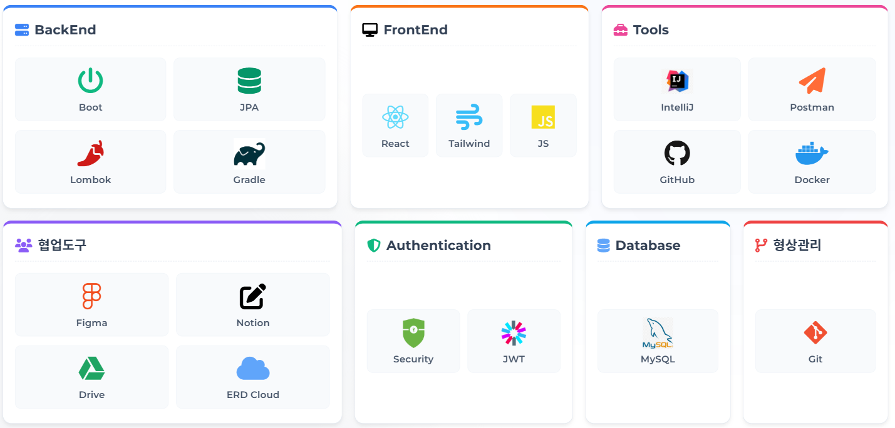
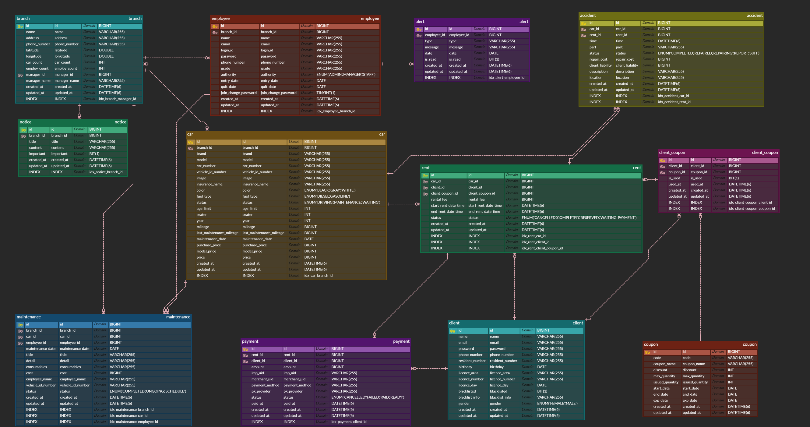

# 🚗 PickCar (공유 차량 통합 운영 관리 플랫폼)

> **"사용자에게는 끊김 없는 예약 경험을, 관리자에게는 데이터 기반의 효율적인 운영 환경을 제공하는 렌터카 ERP 시스템"**

 

## 1. 프로젝트 개요 (Overview)
* **프로젝트명:** PickCar
* **프로젝트 기간 :** 2026.01.07 ~ 2026.01.27
* **기획 의도:**
  B2C 예약 앱과 관리자용 백오피스(Admin)를 데이터로 긴밀하게 연결하여, 예약부터 차량 정비, 매출 정산까지 하나의 흐름으로 관리되는 통합 렌터카 운영 플랫폼을 구축했습니다.

 

## 2. 팀원 소개 (Developers)

| 이름 | 포지션 | 담당 역할 (Responsibilities) | GitHub |
| :---: | :---: | :--- | :---: |
| **강화민** | **PM / BE** | **📅 프로젝트 총괄** - 전체 일정 및 이슈 관리 **💳 예약 & 결제 시스템** - 공유 차량 예약 프로세스 및 결제 연동 - 차량 사고 접수 및 처리 프로세스 구현 | [@Github](https://github.com/hamin-kang) |
| **권재현** | **FE Leader / BE** | **🎨 프론트엔드 아키텍처** - 공통 컴포넌트 설계 및 구현 **👤 마이페이지 & 지점 관리** - 지점별 자산 관리 기능 구현 **🛠 백엔드 품질 관리** - 코드 리뷰 및 성능 최적화 리딩 | [@Github](https://github.com/Galmaeki) |
| **김혜진** | **BE** | **📊 통계 & 데이터 시각화** - 매출/가동률 대시보드 구현 **🎫 쿠폰 시스템** - 쿠폰 발급/관리 및 유효성 검증 로직 **🚗 차량 정보 관리** - 차량 등록 및 현황 관리 시스템 | [@Github](https://github.com/kimhyejin1030) |
| **이대승** | **BE** | **🔧 차량 정비 관리** - 정비 일정/이력 관리 및 로직 구현 **🔔 실시간 알림 서비스** - 정비/예약 관련 알림 구현 **👥 회원 관리** - 회원 정보 수정 및 관리 프로세스 | [@Github](https://github.com/bigwin0207) |
| **조재표** | **BE** | **🔐 인증/인가 (Security)** - JWT 기반 로그인/인증 구현 **👮‍♂️ 권한 관리** - 관리자(직원) 등록 및 권한 부여 프로세스 - 회원가입 프로세스 구현 | [@Github](https://github.com/berichmore) |

 

## 3. 기술 스택 (Tech Stack)

 

## 4. 핵심 기능 (Key Features)

### 👨‍💻 사용자 (Client Service)
* **실시간 예약 시스템:**
    * 예약 기간(`Start~End Date`)과 지점(`Branch`) 기준, 대여 불가능한 차량을 **쿼리 레벨에서 사전에 필터링**하여 중복 예약을 원천 차단했습니다.
* **스마트 쿠폰 적용:**
    * 쿠폰 발급 시 `기간 검증` ➔ `수량 검증` ➔ `중복 검증`의 **3단계 유효성 검사 파이프라인**을 통해 동시성 이슈를 제어했습니다.
* **결제 무결성 검증:**
    * PortOne API 연동 후, 서버단에서 결제 금액과 실제 예약 금액을 교차 검증(Cross-Validation)하여 위변조를 방지했습니다.

### 🏢 관리자 (Admin ERP)
* **차량 생애주기 관리 (LCM):**
    * **지능형 소모품 알림:** 단순 날짜 기준이 아닌, 각 소모품별 교체 주기와 누적 주행거리를 연산하여 정비 대상을 자동 선별합니다.
* **데이터 시각화 대시보드:**
    * 월별/일별 매출 및 가동률을 **Native Query**와 **DTO Projection**으로 최적화하여 조회 속도를 개선했습니다.
* **회원 리스크 관리:**
    * 사고 이력 및 대여 이력을 통합 조회하고, 악성 유저를 블랙리스트로 등록하여 관리합니다.

 

## 5. 시스템 아키텍처 & ERD (Architecture)

 

